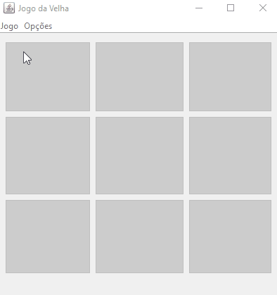

<h1 align="center">Jogo da Velha</h1>
<h4 align="center">Jogo da Velha, em Java com interface gráfica</h4>

<p align="center">
  <a href="#-projeto">Projeto</a>&nbsp;&nbsp;&nbsp;|&nbsp;&nbsp;&nbsp;
  <a href="#-tecnologias">Tecnologias</a>&nbsp;&nbsp;&nbsp;|&nbsp;&nbsp;&nbsp;  
  <a href="#-utilização">Utilização</a>&nbsp;&nbsp;&nbsp;|&nbsp;&nbsp;&nbsp;
  <a href="#-autor">Autor</a>
</p>

<p align="center">
  <br/>
  
  <br>Funcionamento do Jogo da Velha
</p>

## 💻 Projeto

Jogo da Velha desenvolvido em Maio de 2017 como trabalho da disciplina de Programação II [UENP].

## 🚀 Tecnologias

Implementação realizada com a linguagem de programação [Java](https://www.oracle.com/java/) na [IDE NetBeans](https://netbeans.org/).

## 📋 Utilização

### Pré-requisitos

Antes de começar, você vai precisar ter instalado em sua máquina o Java (Release ou SDK):

### Rodando o programa por linha de comando.

Primeiro faça o download do arquivo "JogoDaVelha.jar" do [Release](https://github.com/juanoliveira82/jogo-da-velha/releases) do projeto.

Para poder executar o projeto na linha de comando, acesse um terminal e vá para a pasta onde foi baixado o arquivo Java, e digite o seguinte:
```
java -jar "JogoDaVelha.jar"
```

## 👨‍💻 Autor

[Juan Carlos Cardoso de Oliveira](https://github.com/juanoliveira82) - Estudante do curso de Ciência da Computação na Universidade Estadual do Norte do Paraná (UENP).
